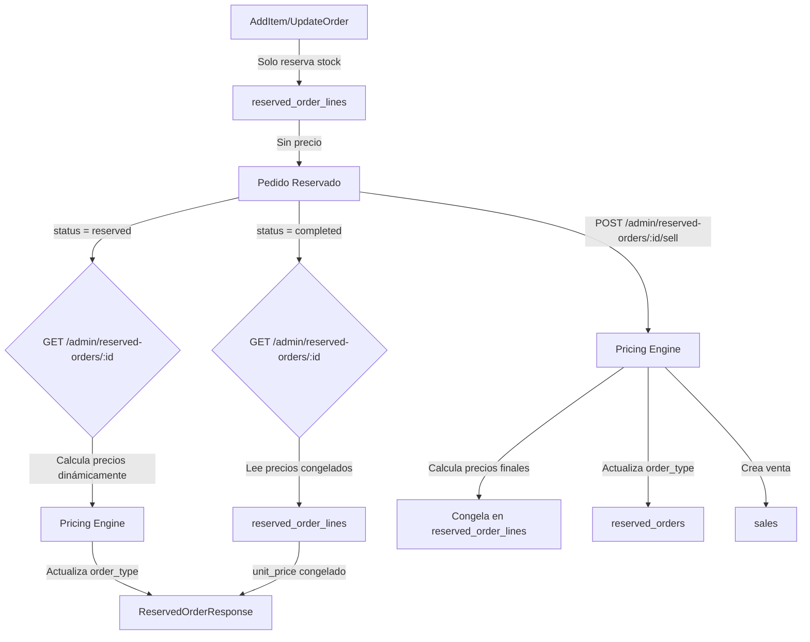

# Pricing Engine Refactor

## Objetivo

Implementar un motor de precios mantenible basado en configuración JSON que calcule precios **SOLO al consultar pedidos en estado "reserved"** y congele snapshots al completar ventas. Actualizar automáticamente `order_type` según las reglas aplicadas.

## Arquitectura

## Cambios Principales

### 1. Configuración JSON (`configs/pricing.json`)

- Crear archivo con estructura completa según especificación
- Definir grupos (BUSOS, CAMISETAS), sizeBuckets, pricebook y rules
- Reglas incluyen: wholesale override 6+, promos 2x por grupo/talla

### 2. Pricing Engine (`service/pricing_engine.go`)

- Servicio que carga config JSON al iniciar
- Método `CalculateOrderPricing(orderID)` que:
- Obtiene líneas del pedido con `hoodie_type` y `size`
- Calcula `globalQtyEligible` (suma BUSOS + CAMISETAS)
- Aplica reglas según prioridad:
    - Si `globalQtyEligible >= 6`: wholesale override (todo wholesale, sin promos)
    - Si `< 6`: aplica bundles 2x por grupo/talla, resto retail
- Retorna breakdown con total, pricing por línea, reglas aplicadas
- Método `UpdateOrderType(orderID)` que actualiza `order_type` según reglas aplicadas

### 3. Cambios en Repository (`repository/reserved_order_repository.go`)

- **AddItem**: Remover cálculo de precio. Solo reservar stock y crear línea sin `unit_price` (o con precio temporal 0)
- **UpdateOrder**: Remover cálculo de precio
- **GetByID**: Integrar pricing engine **SOLO para pedidos en estado "reserved"**
- Si status = "reserved":
    - Obtener líneas con `hoodie_type` y `size`
    - Llamar `CalculateOrderPricing`
    - Construir respuesta con pricing breakdown calculado dinámicamente
    - Actualizar `order_type` si cambió según reglas aplicadas
- Si status = "completed":
    - Leer precios congelados de `reserved_order_lines.unit_price` (ya actualizados al completar venta)
    - Mostrar precios congelados directamente
- Si status = "canceled":
    - Mostrar precios de `reserved_order_lines` (sin recalcular)
- **Complete**: No calcular precios aquí (se hace en Sell)

### 4. Cambios en Sale Repository (`repository/sale_repository.go`)

- **Sell**: 
- Antes de crear venta, calcular pricing final con engine
- Actualizar `order_type` en `reserved_orders` según reglas
- **Congelar snapshot**: Actualizar `unit_price` en `reserved_order_lines` con los precios calculados (esto congela el snapshot)
- Actualizar `sales.amount_paid` con total calculado (o mantener el que viene en request)

### 5. Migración DB

- **NO crear tabla `sales_lines`** - reutilizar `reserved_order_lines` existente
- La tabla `reserved_order_lines` ya tiene `unit_price` que se usará como snapshot
- Al completar venta, actualizar `unit_price` en `reserved_order_lines` con precios calculados (congelar snapshot)
- La relación ya existe: `sales.reserved_order_id` → `reserved_orders.id` → `reserved_order_lines.reserved_order_id`

### 6. Modelos (`models/`)

- Crear `PricingBreakdown` con:
- `Total int64`
- `Lines []PricingLine` (qty, qtyInBundle, qtyRetail, unitPrice, lineTotal, ruleIDs)
- `AppliedRules []string`
- Extender `ReservedOrderResponse` para incluir breakdown opcional
- **NO crear `SaleLine` model** - reutilizar `ReservedOrderLine` existente

### 7. Actualizar `utils/price_calculator.go`

- Mantener funciones legacy para compatibilidad temporal
- Marcar como deprecated
- El nuevo pricing engine reemplazará estas funciones gradualmente

### 8. Endpoints afectados

- `GET /admin/reserved-orders/:id`: 
- Si status = "reserved": Calcula pricing dinámicamente
- Si status = "completed": Retorna precios congelados de reserved_order_lines
- Si status = "canceled": Retorna precios guardados
- `POST /admin/reserved-orders/:id/sell`: Calcula pricing, actualiza order_type, crea snapshot
- `POST /admin/reserved-orders/:id/items`: Ya no calcula precio (solo reserva stock)
- `PUT /admin/reserved-orders/:id`: Calcula pricing dinámicamente

## Flujo de Datos

1. **Agregar items**: Solo reserva stock, no calcula precio
2. **Consultar pedido**: 

- Si status = "reserved": Pricing engine calcula precios dinámicamente, actualiza `order_type` si aplica
- Si status = "completed": Muestra precios congelados de `reserved_order_lines.unit_price`
- Si status = "canceled": Muestra precios guardados en `reserved_order_lines`

3. **Completar venta**: Pricing engine recalcula, congela snapshot actualizando `unit_price` en `reserved_order_lines`, actualiza `order_type` final
4. Actualizar pedido: Pricing engine calcula precios dinámicamente, actualiza `order_type` si aplica

## Consideraciones

- El pricing engine debe ser determinístico (mismo input = mismo output)
- Las promos mezclan tallas (XS/S/M), usar orden consistente (por SKU o lineId)
- IM/PA no participan en conteo de mayorista ni promos
- **IMPORTANTE**: Solo calcular precios cuando se consulta un pedido en estado "reserved". Los pedidos "completed" muestran snapshot congelado en `reserved_order_lines.unit_price`, los "canceled" muestran precios guardados.